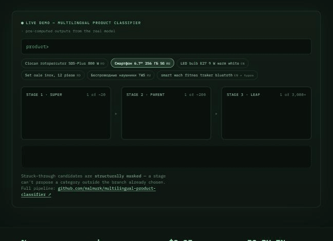
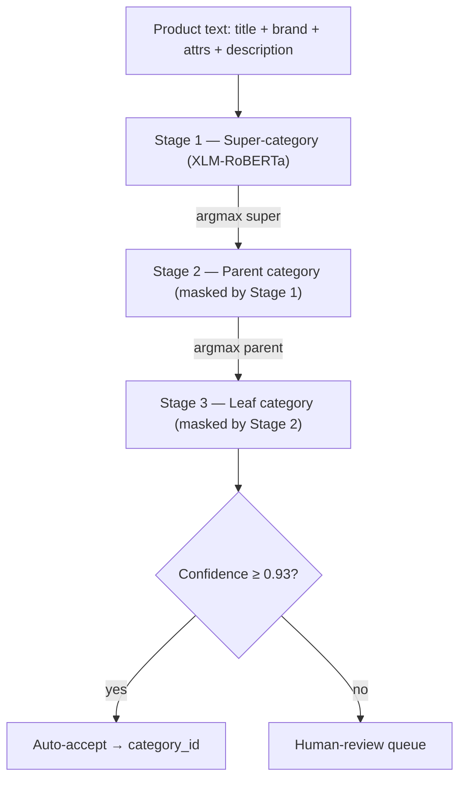

# multilingual-product-classifier

Three-stage multilingual transformer cascade that auto-categorizes free-text product listings into a deep e-commerce taxonomy, with a confidence-gated split between automatic assignment and human review.




## Results

| Metric | Value |
|---|---|
| Auto-classification rate | **90.6%** at leaf confidence ≥ 0.93 |
| Catalog scale | 500k-SKU production catalog |
| Inference cost | ~$0.05 per 1,000 SKUs |
| Pipeline | 3-stage cascade — super → parent → leaf |

Deployed at an Eastern-European marketplace (reference under NDA). Everything below the threshold routes to a `manual_sorting` review queue with the model's full prediction path attached instead of being dropped, and every decision — auto or manual — feeds the retraining loop.

## Architecture



- **Structural masking:** non-child logits are set to `NEG_INF` (-1e10) before softmax at each stage, so the 3,000+-way leaf head only ever competes among the ~10–20 leaves valid under the predicted parent.
- **Production runtime:** checkpoints are exported to ONNX and dynamically quantized to INT8, served on CPU via `onnxruntime.InferenceSession`.

**Per-stage model** (`src/model.py:CategoryClassifier`):

- Encoder: `intfloat/multilingual-e5-base` (XLM-RoBERTa-base, 12 layers / 768 hidden)
- Pooling: attention-mask-weighted mean over token embeddings (pad tokens contribute nothing)
- Head: `Dropout(0.1)` → `Linear(768, num_classes)`
- Stages: super (~20 classes) → parent (a few hundred) → leaf (3,000+, varies by taxonomy version); the leaf stage warm-starts from the parent stage's fine-tuned encoder (`--init-encoder-from`) instead of re-learning from the pretrained base

**Masking detail:** training uses plain cross-entropy over each stage's full class set — masking is inference-only, so the encoder learns to separate every leaf globally rather than only within pre-narrowed branches. Post-mask confidences are renormalized within the surviving branch, so "0.95" means 95% among the valid candidates, not the full class space; the auto-assign threshold is calibrated against exactly this quantity, and re-swept against a held-out set before every deployment.

**ONNX export** (`src/export_onnx.py`) traces a wrapper module that calls the encoder's embedding and layer stack directly with a legacy additive attention mask, because transformers ≥ 4.46 SDPA mask helpers break under `torch.jit.trace` — numerically identical to the training forward, weights untouched.

**Serving** (`classifier/`) — FastAPI service + DB worker, two containers off one image:

- `service.py` — `POST /classify` (single, sync), `POST /classify/batch` (up to 500), `GET /health`, `GET /hierarchy` (taxonomy tree for review-UI dropdowns)
- `worker.py` — polls an `unsorted` queue table, classifies in batches, writes `products.category_id` for predictions at or above threshold (resolving the predicted leaf name through an hourly-refreshed cache), routes everything else to `manual_sorting` with a reason (`non_leaf`, `low_confidence`, `leaf_not_in_db`); sweeps resolved rows off the manual queue each tick; clean shutdown on SIGTERM/SIGINT

## Problem

Built for a production e-commerce catalog. The client is an Eastern-European marketplace (reference under NDA); code is published with their data, weights, and taxonomy removed. This is a scrubbed re-publication: the original development history contained client-identifying data, so it was squashed for the public release.

- Supplier feeds arrive as messy free text — mixed Russian and Romanian, inconsistent brand naming, no attributes, no category hints — and every uncategorized SKU is invisible to filtered search and category browsing.
- Manual sorting doesn't scale: a taxonomy with thousands of leaf categories means real per-product review time, and a 500k-SKU catalog turns that into years of human effort.
- A flat classifier over 3,000+ classes is slow to converge and unreliable at the tail — but the taxonomy's tree structure (super → parent → leaf) is known, machine-readable, and free to exploit. That's the cascade's whole premise.

## Repository layout

```
├── src/                     # training + offline evaluation (PyTorch)
│   ├── model.py             # CategoryClassifier: encoder + masked mean-pool + linear head
│   ├── train.py             # per-stage trainer: bf16 autocast, warmup+cosine, early stopping
│   ├── dataset.py           # JSONL dataset + tokenization
│   ├── taxonomy.py          # taxonomy CSV loader (super/parent/leaf tree)
│   ├── predict.py           # cascaded masked prediction against PyTorch checkpoints
│   ├── export_onnx.py       # trace-based ONNX export + dynamic INT8 quantization
│   ├── evaluate.py          # held-out metrics per stage
│   └── ...                  # data building, augmentation, eval experiments
├── classifier/              # production service (ONNX Runtime, no PyTorch dependency)
│   ├── predictor.py         # three-stage masked predictor over InferenceSessions
│   ├── hierarchy.py         # taxonomy tree + masked_softmax
│   ├── preprocessor.py      # builds the model input text from product fields
│   ├── service.py           # FastAPI: /classify, /classify/batch, /health, /hierarchy
│   ├── worker.py            # DB queue worker: auto-assign vs manual_sorting routing
│   ├── docker-compose.yml   # api + worker containers off one image
│   └── .env.example
├── docs/
│   ├── architecture/        # pipeline overview, data flow, text format, production wrapper
│   └── features/            # cascaded prediction, auto-assign threshold, class weights
├── tests/                   # pytest: hierarchy masking, taxonomy, ONNX export parity,
│                            #         worker resolver, dataset/preprocess/train units
├── requirements*.txt        # training / inference / docker splits
└── docker-compose.yml       # training container
```

## Training

Trained on a single consumer AMD GPU via ROCm — no CUDA hardware, no cloud training budget. The trainer accounts for the platform explicitly:

- One dummy forward+backward before epoch 1 to trigger MIOpen HIP-kernel compilation (`MIOPEN_FIND_MODE=FAST`), so the first real batch isn't a multi-minute stall.
- bf16 autocast throughout, with a non-finite-loss guard that skips a diverged batch instead of poisoning the run.

What made a 3,000+-way head trainable at all:

- **Split learning rates:** the fresh classifier head trains at 50× the encoder LR (`--head-lr-mult`) — millions of randomly-initialized head parameters need far more gradient signal than a pretrained encoder should receive.
- **Step-level linear warmup → cosine decay**, so the first few hundred updates on a huge fresh head don't diverge.
- **Leaf warm-start:** the leaf stage copies the parent stage's fine-tuned encoder weights before training (`--init-encoder-from`), skipping a full re-fine-tune of the backbone.
- Gradient clipping, early stopping on validation loss, resumable checkpoints with optimizer state.

```bash
python -m src.train --stage super  --epochs 20
python -m src.train --stage parent --epochs 20
python -m src.train --stage leaf   --epochs 20 \
    --init-encoder-from models/checkpoints/parent/best_model.pt \
    --head-lr-mult 50
python -m src.export_onnx --stage leaf --checkpoint models/checkpoints/leaf/best_model.pt
```

## What is not included

This repository is the code, not the model. The following are client property and are **not included in this repository**:

- Trained model weights and ONNX exports
- Taxonomy CSVs (`taxonomy_full.csv`, `taxonomy_live.csv`, `taxonomy_pruned.csv`, `taxonomy_universe.csv`, `taxonomy_v3.csv`)
- Training data, evaluation sets, and database dumps

To run the pipeline end to end you would supply your own taxonomy CSV and labeled product data in the documented formats (`docs/architecture/text-format.md`), train the three stages, and export. The code paths are complete; the artifacts are yours to produce.

## Running the service

The production wrapper under `classifier/` expects trained ONNX models in a mounted directory and (for the worker) a MariaDB/MySQL database with `products`, `categories`, and the two queue tables (`unsorted`, `manual_sorting`).

```bash
cd classifier
cp .env.example .env      # set DB_URL to your database, adjust thresholds if needed
docker-compose up -d      # starts: api (127.0.0.1:8000) + worker
```

- The API binds to localhost only — it is designed to be called by a backend on the same host, not exposed publicly.
- Models are volume-mounted rather than baked into the image, so a retrain deploys as file sync + container restart, not an image rebuild.
- All knobs are environment variables (see `classifier/.env.example`): `THRESHOLD_LEAF_AUTO` (default 0.93), worker `BATCH_SIZE` / `POLL_INTERVAL`, resolver refresh interval, corrections-log path.

Smoke test:

```bash
curl -s localhost:8000/health
curl -s localhost:8000/classify -X POST -H 'Content-Type: application/json' \
     -d '{"title": "Ноутбук Lenovo IdeaPad 3 15.6\" 8GB RAM"}'
```

## License

MIT.
